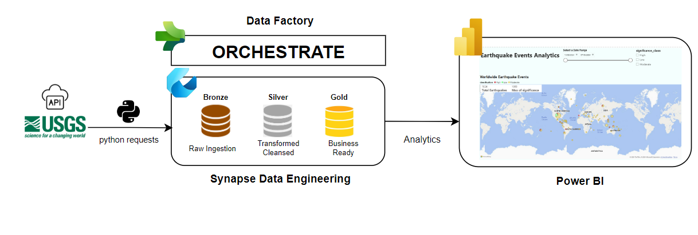

# Earthquake Analytics With Microsoft Fabric

## Overview
This project is an end-to-end data engineering and analysis pipeline built using Microsoft Fabric. It ingests, processes, and analyzes global earthquake events data, providing actionable insights through reporting and visualization in Power BI.

## Goal
The goal of this project is to transform raw earthquake data into refined, business-ready datasets that are optimized for analytics, reporting, and visualization.

## Architecture
The project architecture consists of three primary layers:
1. **Bronze Layer**: Raw earthquake data is ingested from the USGS API with minimal processing.
2. **Silver Layer**: The data is cleaned, transformed, and consolidated for further analysis.
3. **Gold Layer**: Refined, business-ready datasets are optimized for high-value insights and reporting in Power BI.

## Technologies Used
- **Microsoft Fabric**: For data engineering, orchestration, and processing.
- **Data Factory**: For data ingestion and pipeline orchestration.
- **Data Engineering**: For data transformation and storage.
- **Power BI**: For reporting and visualization.
- **Python & PySpark**: For data processing and transformation.
- **USGS API**: As the source for earthquake event data.

## Implementation Steps
1. **Ingest Raw Data (Bronze Layer)**:
   - Use Microsoft Fabric's Data Factory to ingest earthquake data from the USGS API.
   - Store the data in its original format for further processing.

2. **Data Cleaning & Transformation (Silver Layer)**:
   - Clean and transform the raw earthquake data using PySpark.
   - Consolidate the data for analytical purposes, including filtering irrelevant records and handling missing values.

3. **Create Business-Ready Datasets (Gold Layer)**:
   - Further refine the data to create optimized datasets for analysis.
   - These datasets are used for visualizations in Power BI, enabling real-time insights and reporting.

4. **Visualization and Reporting**:
   - Create interactive reports in Power BI using the refined earthquake data.
   - Provide insights on earthquake patterns, trends, and impacts.

## Conclusion
This project demonstrates the power of Microsoft Fabric in building an efficient data engineering pipeline, transforming raw earthquake data into valuable insights. By leveraging Data Factory, Data Engineering, and Power BI, we can automate the ingestion, transformation, and analysis of seismic event data for real-time reporting and decision-making.
