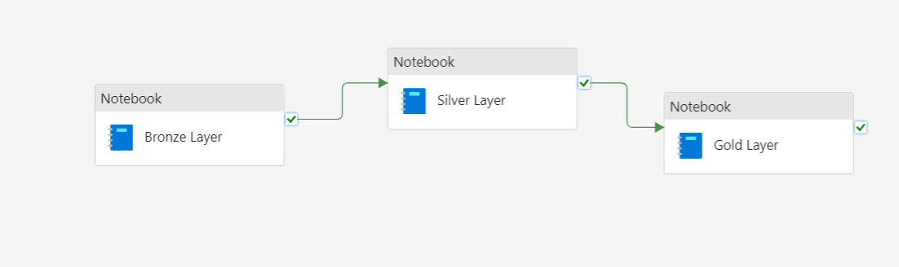

# Earthquake Analytics With Microsoft Fabric

## Overview
This project is an end-to-end data engineering and analysis pipeline built using Microsoft Fabric. It ingests, processes, and analyzes global earthquake events data, providing actionable insights through reporting and visualization in Power BI.

## Goal
The goal of this project is to transform raw earthquake data into refined, business-ready datasets that are optimized for analytics, reporting, and visualization.

## Architecture

The project architecture follows a Medallion Architecture approach, consisting of three primary layers:

1. **Bronze Layer**: Raw earthquake data is ingested from the USGS API with minimal processing. This layer serves as the foundational data repository.

2. **Silver Layer**: The data is cleaned, transformed, and consolidated. Key fields are extracted, and data is prepared for analytical processing.

3. **Gold Layer**: Refined, business-ready datasets are created. These datasets are optimized for high-value insights and reporting, and are ready for visualization in Power BI.

## Technologies Used
- **Microsoft Fabric**: For data engineering, orchestration, and processing.
- **Data Factory**: For data ingestion and pipeline orchestration.
- **Data Engineering**: For data transformation and storage.
- **Power BI**: For reporting and visualization.
- **Python & PySpark**: For data processing and transformation.
- **USGS API**: As the source for earthquake event data.

## Implementation Steps
Following resources were used to implement the pipeline:

### 1. Bronze Layer: Raw Data Ingestion
- **Objective**: Fetch and store raw earthquake data from the USGS API with minimal processing.
- **Process**: Save the raw data in its original format for further refinement.

### 2. Silver Layer: Data Cleaning & Transformation
- **Objective**: Extract key fields like coordinates, magnitude, and time, and clean the data for analytical use.
- **Process**: Select specific fields, convert time formats, and save the processed data as a table.

### 3. Gold Layer: Data Enrichment & Refinement
- **Objective**: Prepare business-ready data by further refining and enriching the cleaned data.
- **Process**: Add country codes, classify significance, and append data to a final table for reporting and analysis.

### 4. Data Orchestration
- **Objective**: Automate and manage the entire data pipeline.
- **Process**: Utilize Microsoft Fabric Data Factory to orchestrate data ingestion, processing, and scheduling. Ensure seamless data flow between Bronze, Silver, and Gold layers.

### 5. Visualization and Reporting
- **Objective**: Create interactive reports and dashboards to visualize earthquake data.
- **Process**: Use Power BI to generate insights on earthquake patterns, trends, and impacts.

## Conclusion
The pipeline successfully ingests, processes, and refines earthquake data from the USGS API, transforming it into actionable insights. By leveraging Microsoft Fabric’s Data Factory for orchestration and Power BI for visualization, the project delivers comprehensive and interactive reports on global earthquake events.